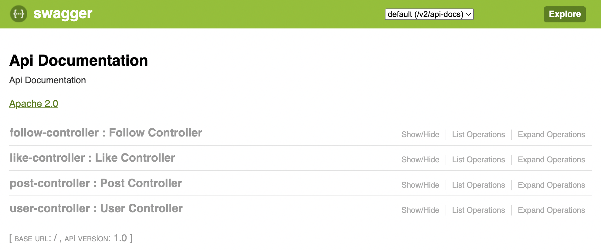
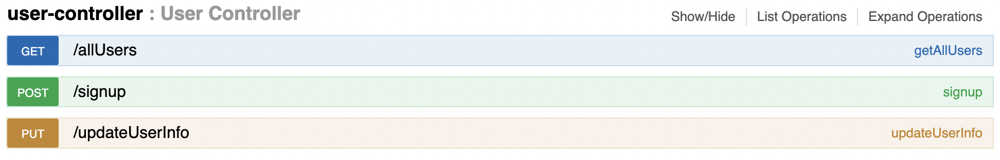
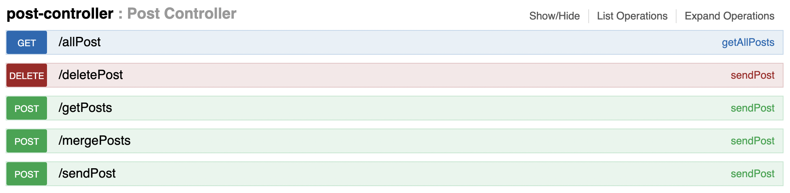
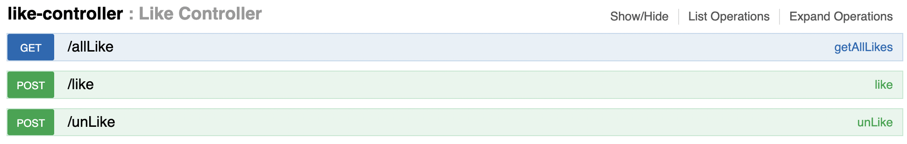
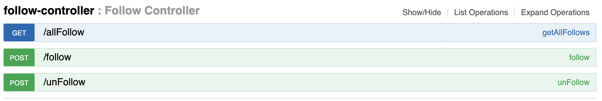

# Social Media Sample

**Project Url**: 

## Rest API ( Social Media )

### Controllers and Endpoints

- User Controller
    - Sign Up User
    - Update User Info
    - All Users

- Post Controller
    - Send Post
    - Delete Post
    - All Posts
    - Send Post
    - Merge Post

- Like Controller

    - Like Post
    - Unlike Post
    - All Post

- Follow Controller

    - Follow User
    - Unfollow User
    - All Follow

Note:
- **Swagger-UI URL** : http://localhost:8080/swagger-ui.html

## How to run
- Project
  - cd {project-folder}/docker
  - docker compose up -d --build
- Postman
  - cd {project-folder}/postman/SocialMedia.postman_collection.json

## Languages and Tools
- Java 8
- Spring Boot
- Maven
- PostgresDB
- Docker
- Swagger
- Postman

## Personenel Info

- **Developer**: Taha Başkak
- **LinkedIn** : https://www.linkedin.com/in/tahabaskak/
- **Github** : https://github.com/tahabaskak

